# 🌿 Crop Disease Detector

**A fine-tuned YOLOv8 deep-learning model that identifies 15 crop diseases from a single leaf photo — and tells you how to treat each one.** Built end-to-end: data pipeline, training, evaluation, and a live drag-and-drop web app.

<p align="center">
  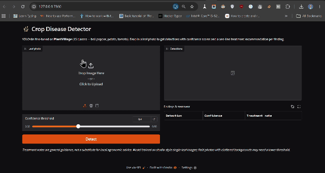
</p>

> Drop in a leaf photo → the model draws a box around the leaf, names the disease with a confidence score, and shows a one-line treatment recommendation.

---

## 📊 Results at a glance

Evaluated on a **held-out test set of 2,076 images the model never saw during training** — the honest measure of real performance.

<table>
  <tr>
    <th>Metric</th><th>Score</th><th>What it means</th>
  </tr>
  <tr>
    <td><b>mAP@50</b></td><td align="center"><b>0.992</b></td><td>Overall detection accuracy (out of 1.0)</td>
  </tr>
  <tr>
    <td><b>Precision</b></td><td align="center"><b>0.987</b></td><td>When it flags a disease, it's right ~99% of the time</td>
  </tr>
  <tr>
    <td><b>Recall</b></td><td align="center"><b>0.979</b></td><td>It catches ~98% of diseases that are actually present</td>
  </tr>
  <tr>
    <td><b>mAP@50-95</b></td><td align="center"><b>0.955</b></td><td>Accuracy under a stricter localization standard</td>
  </tr>
</table>

Every one of the 15 classes scores above **0.98 mAP@50**. Full per-class breakdown: [`results/per_class_metrics.md`](results/per_class_metrics.md).

<p align="center">
  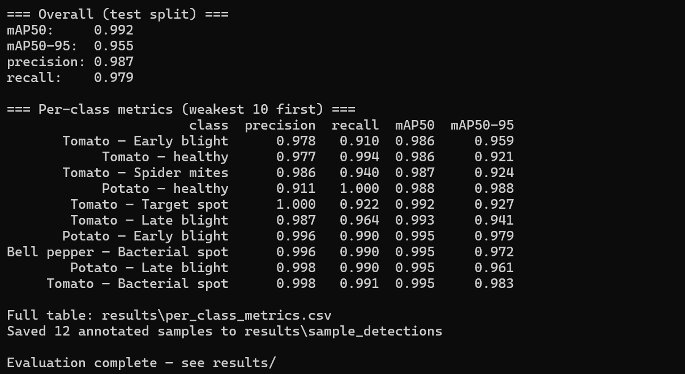
</p>

---

## 🖥️ The app

<p align="center">
  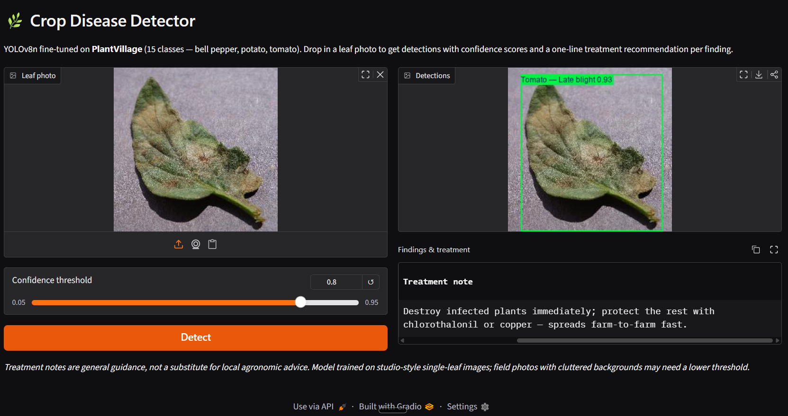
</p>

- **Drag-and-drop** any leaf photo.
- **Bounding box + confidence** drawn on the image.
- **Treatment table** — every detected disease comes with a practical, one-line treatment note.
- **Confidence slider** — tune how strict the detector is (lower = catch more, higher = only high-certainty results).

## 🔍 Sample detections

Real predictions on test images (boxes + confidence scores), straight from the model:

<p align="center">
  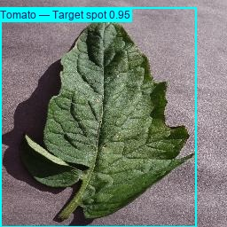
  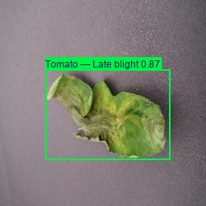
  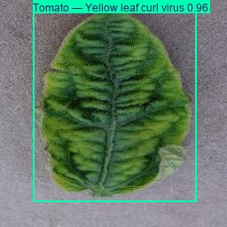
  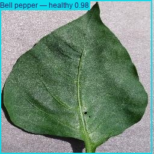
</p>

---

## 🌱 What it detects

15 disease and healthy classes across **3 crops**:

| Crop | Classes |
|------|---------|
| 🫑 **Bell pepper** | Bacterial spot · Healthy |
| 🥔 **Potato** | Early blight · Late blight · Healthy |
| 🍅 **Tomato** | Bacterial spot · Early blight · Late blight · Leaf mold · Septoria leaf spot · Spider mites · Target spot · Mosaic virus · Yellow leaf curl virus · Healthy |

Best results come from **single-leaf photos on a plain background** — the style the model was trained on. Field photos with cluttered backgrounds work too; just lower the confidence slider.

---

## ⚙️ How it was built

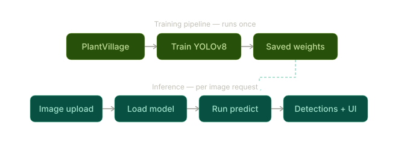

| Stage | What happens | Script |
|-------|--------------|--------|
| **1. Data** | PlantVillage (~20.6K images) downloaded and converted to YOLO detection format; leaf bounding boxes auto-generated via OpenCV segmentation; split 70/20/10 train/val/test | [`prepare_dataset.py`](prepare_dataset.py) |
| **2. Train** | Fine-tune YOLOv8n from pretrained weights | [`train.py`](train.py) |
| **3. Evaluate** | Per-class metrics, training curves, confusion matrix, annotated samples | [`evaluate.py`](evaluate.py) |
| **4. Demo** | Gradio web app with treatment recommendations | [`app.py`](app.py) |

<p align="center">
  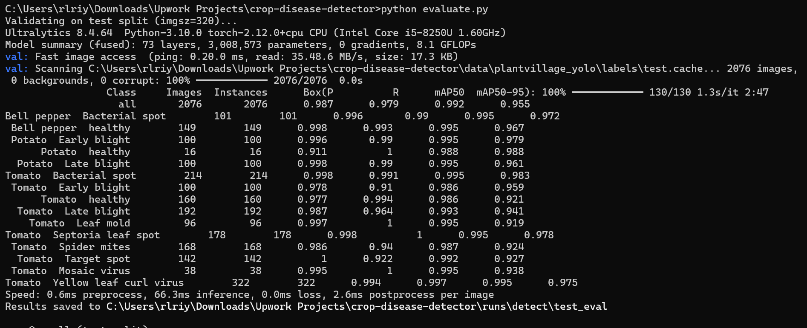
</p>

### Training diagnostics & confusion matrix

<p align="center">
  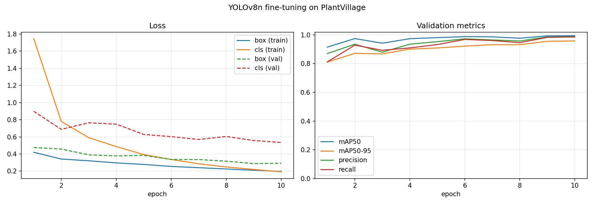
  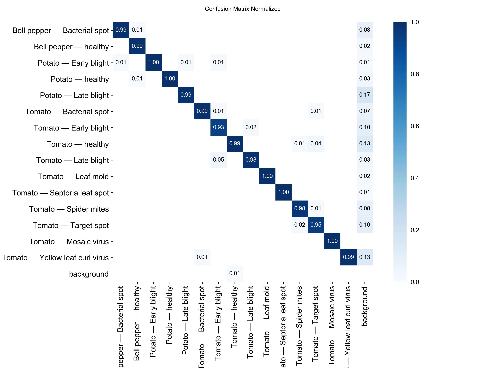
</p>

The loss curves fall steadily while accuracy climbs, and the confusion matrix shows a clean diagonal — the model rarely mistakes one disease for another.

---

## 🚀 Run it yourself

```bash
pip install -r requirements.txt

# 1. Build the dataset (reads a manual PlantVillage download at data/archive/PlantVillage/,
#    or add --download to fetch from Kaggle)
python prepare_dataset.py

# 2. Train (GPU recommended; --device cpu also works)
python train.py --device 0

# 3. Generate the evaluation report
python evaluate.py

# 4. Launch the web app at http://127.0.0.1:7860
python app.py
```

Pretrained weights are included at [`weights/best.pt`](weights/best.pt), so you can skip straight to step 4.

## 📁 Project structure

```
crop-disease-detector/
├── prepare_dataset.py      ← dataset download + YOLO conversion
├── train.py                ← fine-tuning script
├── evaluate.py             ← metrics, curves, confusion matrix, samples
├── app.py                  ← Gradio web app
├── treatments.py           ← 38 disease treatment recommendations
├── weights/best.pt         ← trained model
├── data/data.yaml          ← dataset config (15 classes)
├── configs/                ← training hyperparameters
├── results/                ← metrics + annotated sample detections
├── examples/               ← sample leaf images to try in the app
├── assets/                 ← demo video, GIF, screenshots, pipeline diagram
├── notebooks/              ← full documented training walkthrough
└── requirements.txt
```

## 🛠️ Tech stack

| Layer | Tool |
|-------|------|
| Model | Ultralytics **YOLOv8n** (PyTorch) |
| Dataset | PlantVillage — [15-class subset](https://www.kaggle.com/datasets/emmarex/plantdisease) (~20.6K images) |
| Evaluation | Ultralytics metrics (mAP, precision, recall, confusion matrix) |
| Web app | **Gradio** |
| Deployment | Hugging Face Spaces (Gradio SDK) |

---

## 📝 Notes & honesty

- PlantVillage images are studio-style single leaves on plain backgrounds; field photos with heavy clutter will underperform — lower the confidence slider in those cases.
- Bounding boxes are auto-derived (one leaf per image), so this is detection-style packaging of a classification dataset; localization quality reflects that.
- Treatment notes are general guidance, not a substitute for local agronomic advice.

🎥 Full demo video: [`assets/demo_video.mp4`](assets/demo_video.mp4)
